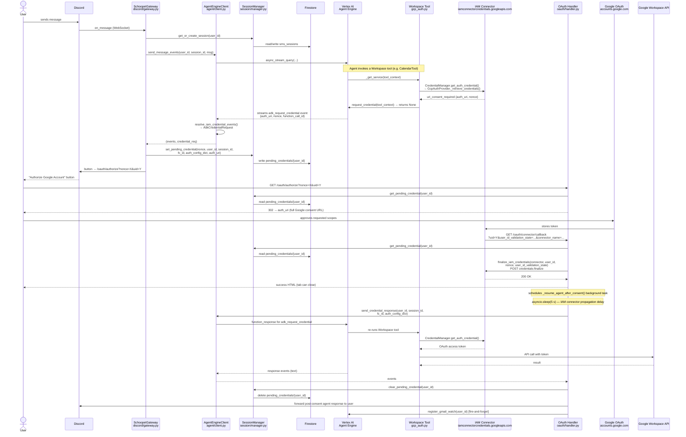
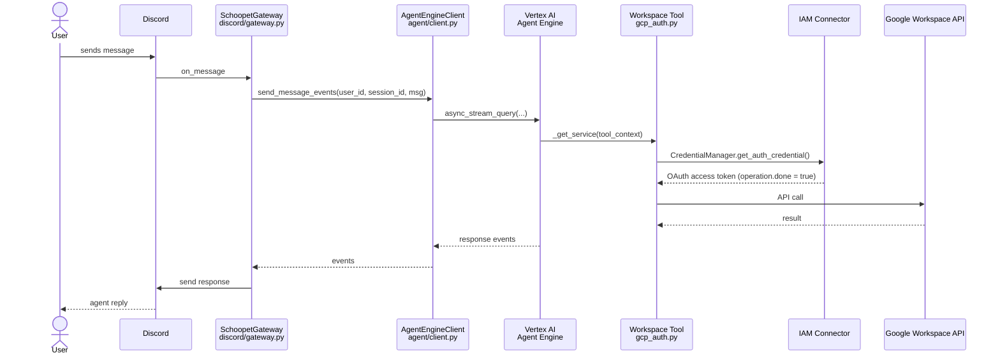

# Auth Flow: Agent-Triggered OAuth Consent

This document traces how a Google Workspace tool call in the agent triggers an OAuth consent request, routes it to the user, and resumes after consent. It covers CUJ 2 (first-use consent) and the auto-resolve path (subsequent use), plus the email-triggered variant.

For the migration from custom OAuth to IAM connectors, see [iam-connectors-adoption-plan.md](iam-connectors-adoption-plan.md).

---

## Components

| Component | Location | Role |
|---|---|---|
| **SchoopetGateway** | `sms-gateway/src/discord/gateway.py` | WebSocket listener; sends messages to agent; interprets credential requests; sends Discord auth button |
| **EmailHandler** | `sms-gateway/src/email/handler.py` | Pub/Sub webhook; calls agent in offline mode; stores pending credential and sends auth link via Discord |
| **AgentEngineClient** | `sms-gateway/src/agent/client.py` | Wraps Vertex AI Agent Engine SDK; streams events; `resolve_iam_credential_events()` detects auth events; `send_credential_response()` resumes agent after consent |
| **SessionManager** | `sms-gateway/src/session/manager.py` | Firestore CRUD for `sms_sessions` and `pending_credentials`; pending credentials are keyed by `user_id` |
| **OAuthHandler** | `sms-gateway/src/oauth/handler.py` | `GET /oauth/authorize` — short-URL redirect to Google consent; `GET /oauth/connector/callback` — finalizes credential and resumes agent |
| **connector.py** | `sms-gateway/src/auth/connector.py` | `finalize_iam_credentials()` — single REST call to `iamconnectorcredentials.googleapis.com/.../credentials:finalize` |
| **Workspace Tools** | `agents/schoopet/{calendar,drive_sheets,email}_tool.py` | Call `get_workspace_service()` on each invocation; return `None` when credentials are missing (triggers auth event) |
| **gcp_auth.py** | `agents/schoopet/gcp_auth.py` | Registers `GcpAuthProvider` at import; `get_workspace_service()` is the tool-side entry point for all Workspace credential fetching |
| **ADK CredentialManager** | ADK library (`google-adk[agent-identity]`) | `get_auth_credential()` calls the IAM connector; `request_credential()` emits the `adk_request_credential` ADK event |
| **IAM Connector** | `iamconnectorcredentials.googleapis.com` | Stores per-user OAuth tokens; issues consent URL on first use; finalizes token storage after user consent |
| **Google OAuth** | `accounts.google.com` | Consent page; redirects to `IAM_CONNECTOR_CONTINUE_URI?uid=...` after approval |
| **Firestore** | GCP | `sms_sessions` — session state; `pending_credentials/{user_id}` — in-flight auth record |

### Key design constraints

- `pending_credentials` is keyed by `user_id`, not by nonce. The IAM connector nonce is deterministic (not random per request) and can repeat across users — keying by nonce would cause cross-user collisions.
- The Discord button points to `/oauth/authorize` (a short gateway URL) rather than `auth_uri` directly, because the IAM connector `auth_uri` contains all OAuth parameters inline and exceeds Discord's button URL length limit.
- A fixed 5-second `asyncio.sleep` follows `credentials:finalize` before the agent is resumed. This allows the IAM connector backend to transition from `uri_consent_required` to token-available state before the ADK retries the blocked tool.

---

## CUJ 2a — First use (consent required)

---

## CUJ 2b — Subsequent use (token cached by IAM connector)

On every call after the initial consent, the IAM connector returns the stored token immediately. No user interaction is needed.

---

## Email-triggered variant (CUJ 3 × CUJ 2)

When Gmail Pub/Sub delivers an email that triggers a Workspace tool on a fresh user session, the credential path diverges from the Discord path in two ways:

1. **Auth link delivered via Discord, not email.** The email handler stores the pending credential and sends the auth button to the user's Discord channel — the consent flow itself is identical to CUJ 2a above.
2. **Email processing is NOT automatically re-run after consent.** Unlike the Discord path (where the agent is immediately resumed with the original task context), the email job that triggered the consent is not replayed. After the user consents and the agent is resumed, the agent receives only the credential response, not the original email context. This is a current limitation noted in `iam-connectors-adoption-plan.md`.

Also unlike confirmation requests in email mode (which are auto-declined to avoid blocking), credential requests are NOT auto-declined — the pending auth is held open for the user to complete.

---

## Simplification observations

These are findings from reviewing the flow. No code changes are planned.

### `/oauth/authorize` redirect layer (keep — structurally required)

The Discord button points to `/oauth/authorize?nonce=X&uid=Y` rather than the IAM connector `auth_uri` directly. The short URL is necessary because Discord enforces a URL length limit and `auth_uri` contains all OAuth parameters inline — it far exceeds that limit. The nonce validation step also prevents stale buttons from triggering a consent flow for a different pending request.

### 5-second propagation delay (keep — deliberately simple)

The `asyncio.sleep(5.0)` in `_resume_agent_after_consent()` gives the IAM connector backend time to make the stored token available before the agent retries the blocked tool. A retry-with-backoff would handle slow propagation more precisely but adds complexity for no reliability gain in practice.

### `pending_credentials` keyed by `user_id` (keep — correct by design)

The IAM connector nonce is not random per request; it is deterministic and can be identical across users. Keying by nonce would cause cross-user collisions — one user's callback routing to another user's pending record. The `user_id` key is the correct design. The consequence is that only one pending auth is allowed per user at a time.

### Gmail watch registration coupling (observation — open item)

`register_gmail_watch()` is called as a fire-and-forget at the end of `_resume_agent_after_consent()`. If it fails, no watch is set up and the error is swallowed silently. A cleaner approach would be a dedicated agent tool call so the user sees failures and can re-trigger. This is already flagged as an open item in `iam-connectors-adoption-plan.md`.
